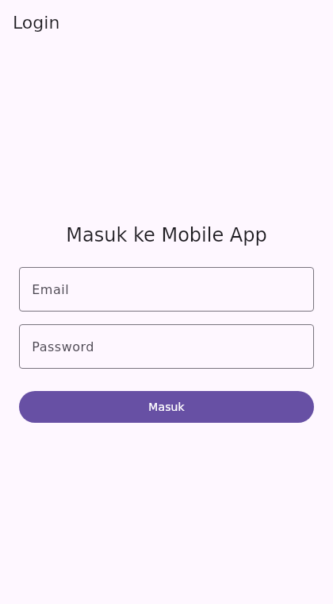
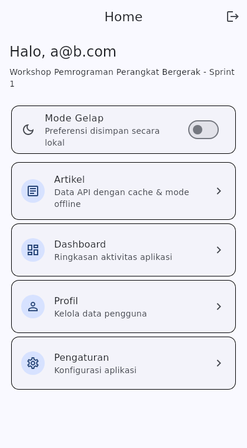
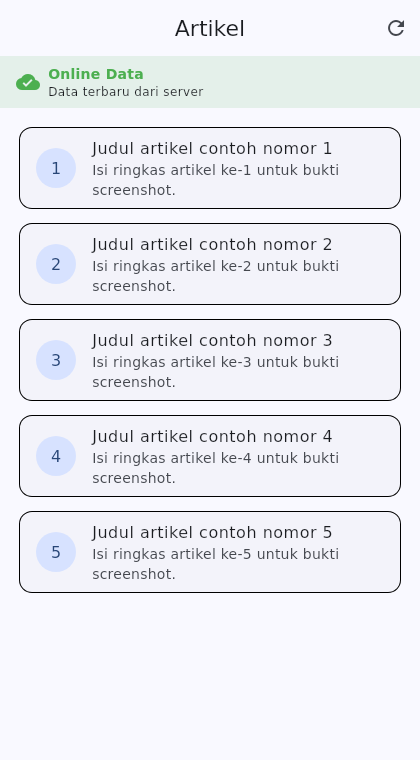
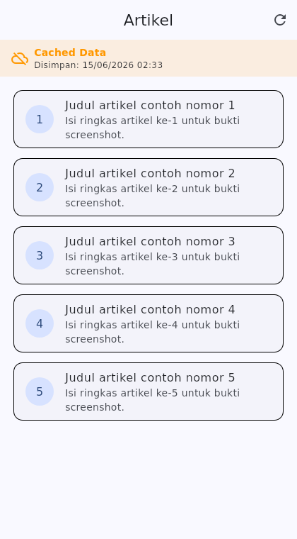

# Laporan Modul 6 — Local Storage, Caching, dan Offline Mode

Workshop Pemrograman Perangkat Bergerak · PENS — Teknik Informatika dan Komputer
Sprint 1, Week 5 · Metode: Project-Based Learning · Tanggal: 2026-06-15

## 1. Learning Outcomes

Memahami peran local storage pada aplikasi mobile, membedakan penyimpanan
sederhana (key-value) dan terstruktur, mengimplementasikan local storage pada
Flutter dengan `shared_preferences`, menyimpan/membaca data lokal,
menggabungkan data API dengan cache lokal, serta membangun dasar aplikasi yang
siap untuk kondisi offline.

## 2. Dependency

Menambahkan `shared_preferences: ^2.2.0` pada `pubspec.yaml` (melengkapi
`http` dan `provider` dari modul sebelumnya). `flutter pub get` sukses.

## 3. Arsitektur & Struktur Folder

Struktur ditata makin rapi sesuai anjuran modul (Bagian 9):

```
lib/
├── core/
│   ├── constants/   app_constants.dart
│   ├── storage/      local_storage.dart        (helper shared_preferences)
│   └── theme/        app_theme.dart
├── data/
│   ├── models/       post_model.dart
│   ├── repositories/ post_repository.dart       (gabung API + cache)
│   └── services/     post_service.dart           (akses jaringan murni)
├── presentation/
│   ├── providers/    post_provider.dart, theme_provider.dart
│   ├── screens/      login, home, detail, posts_screen.dart
│   └── widgets/      feature_card.dart
└── main.dart
```

## 4. Implementasi

### 4.1 Penyimpanan Data Sederhana (shared_preferences)

`core/storage/local_storage.dart` menjadi helper terpusat key-value:

- `username` (String) — disimpan saat login.
- `is_logged_in` (bool) — status login, dibaca saat app start untuk auto-login.
- `dark_mode` (bool) — preferensi tema (Tugas Mandiri).
- `cached_posts` (String) + `cached_at` — cache response API.

Semua key dijadikan konstanta agar tidak salah ketik dan mudah dipelihara.

### 4.2 Caching Data API (Bagian 6)

Alur pada `data/repositories/post_repository.dart`:

- Request API berhasil → simpan response (JSON String) ke cache, sumber data
  ditandai `network`.
- Request API gagal → ambil cache lama bila ada, sumber data `cache`.
- Gagal dan cache kosong → `rethrow` (UI menampilkan layar error + tombol coba
  lagi).

`PostService` (`data/services/post_service.dart`) hanya mengurus jaringan
(JSONPlaceholder, 20 item, timeout 10 detik); logika offline terpusat di
repository sehingga tanggung jawab tiap lapisan jelas.

### 4.3 Offline Mode & Indikator Sumber Data (Bagian 7)

`presentation/screens/posts_screen.dart` menampilkan banner sumber data:

- Hijau "Online Data" — data terbaru dari server.
- Oranye "Cached Data" — data dari cache lokal + waktu cache.

Aplikasi tetap usable saat koneksi hilang: menampilkan data terakhir, bukan
error kosong. Tersedia pull-to-refresh dan tombol muat ulang.

### 4.4 State Management (Provider)

- `PostProvider` — mengelola daftar post, loading state, dan sumber data.
- `ThemeProvider` — preferensi dark mode yang dipersistensi via LocalStorage.

Keduanya didaftarkan lewat `MultiProvider` di `main.dart`.

## 5. Tugas Mandiri

| Tugas | Implementasi |
|-------|--------------|
| Tombol Logout (hapus login status lokal) | Ikon logout di AppBar Home → `LocalStorage.clearSession()` lalu kembali ke Login |
| Label "Online Data" / "Cached Data" | Banner sumber data di PostsScreen |
| Preferensi sederhana (dark mode flag, nama user) | Switch dark mode (persisten) + sapaan username tersimpan di Home |

## 6. Verifikasi

- `flutter pub get` → sukses (shared_preferences 2.5.5 terpasang).
- `flutter analyze` → No issues found.
- `flutter test` → All tests passed (widget test memakai
  `SharedPreferences.setMockInitialValues` + provider).

## 7. Git Workflow

- Branch fitur: `feature/local-storage` (sesuai instruksi modul Bagian 10.4).
- Commit message profesional dengan konvensi `feat(local-storage): ...`.
- Remote: `github.com/Fishir123/mobile_app`.

## 8. Bukti Screenshot

Screenshot dihasilkan secara reproducible lewat golden test
(`test/screenshots_test.dart`, dijalankan dengan
`flutter test --update-goldens`).

### [1] Login Screen


### [2] Home Screen (sapaan username, toggle dark mode, tombol Logout)


### [3] Artikel — Online Data (banner hijau, data dari server)


### [4] Artikel — Cached Data (banner oranye, fallback offline)


## 9. Checklist Evaluasi

| Item | Status |
|------|--------|
| Package shared_preferences berhasil dipasang | ✓ |
| Data sederhana berhasil disimpan dan dibaca | ✓ |
| Cache API tersimpan lokal | ✓ |
| Data cache muncul saat API gagal | ✓ |
| Struktur folder tetap rapi | ✓ |
| Provider tetap digunakan | ✓ |
| Commit message profesional | ✓ |

## 10. Catatan / Penyimpangan

- Project Modul sebelumnya belum memiliki lapisan API (services/models/
  repositories), sehingga pada modul ini ditambahkan model/service/repository
  `Post` berbasis JSONPlaceholder sebagai dasar caching. Bila API tim berbeda,
  cukup sesuaikan `post_service.dart` dan `post_model.dart`.
- Untuk penyimpanan terstruktur skala besar (list besar, relasi, query),
  modul menganjurkan database lokal seperti Hive/Sqflite/Isar — di luar cakupan
  pertemuan ini yang fokus pada shared_preferences.
